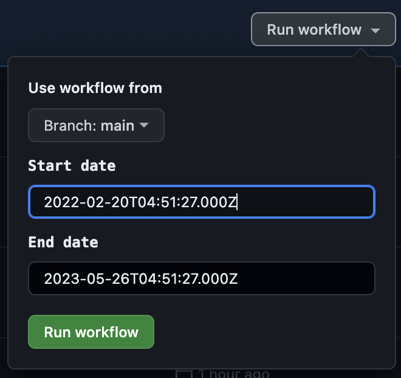

# Completed Date Notion

Notion doesn't have an option to setup date when task is completed. So aim of the repository is setting "Completed At" property to have visibility of how many tasks were completed and when.

## How it works

"Modified At" property is used to setup Completed Date. All the tasks that modified today, have "Completed" status and empty "Completed At" property will get assigned "Modified At" value to the "Completed At" property. 

## Completed Date for old tasks

In case, you have many old tasks, it is still possible to initialize "Completed At" field. To initialize it, you need to specify `startDate` and `endDate` in `completeOldTasks.js` and run it `node completeOldTasks.js` 

Alternatively, you can fork the repository and manually run github actions.
Before the run you will be able to specify **start date** and **end date** which should be completed.

## Articles about task management in Notion (in Russian)

- [Система личного планирования в Notion. Эпизод 1 — Инбокс](https://habr.com/ru/articles/696416/)
- [Система личного планирования в Notion. Эпизод 2 — Управление проектами](https://habr.com/ru/articles/696698/)

